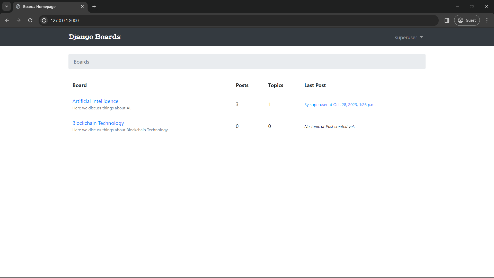
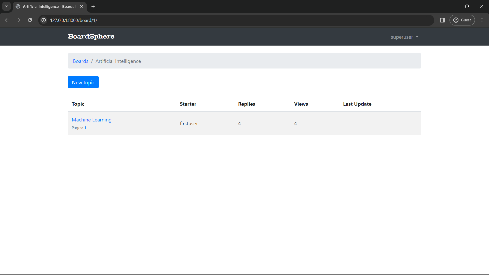
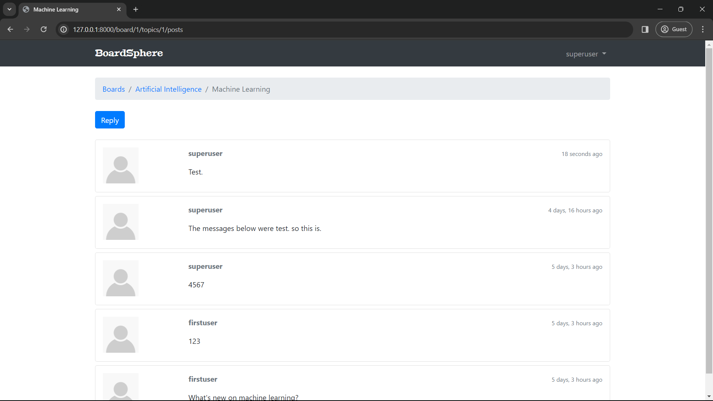

# BoardSphere

## Introduction
BoardSphere is a collaborative discussion platform where users can engage in real-time conversations on a variety of topics.
At the heart of BoardSphere are "boards" dedicated to broad fields like Artificial Intelligence. 
Within each board, users can create and navigate through topics such as Machine Learning to delve into more specific discussions. 
The project encapsulates a real-time chatting environment akin to a Facebook Messenger group chat, where every registered user viewing a topic can participate in the live discussion.

## Features
- **Real-Time Chatting**: Engage in live discussions with other users on any given topic.
- **Structured Discussions**: Navigate through boards and topics to find or initiate discussions on your areas of interest.
- **WYSIWYG Markdown Editor**: Format your replies with ease using the What You See Is What You Get markdown editor.
- **Topic View Count**: Stay updated on the popularity and engagement level of topics with a view count feature.
- **User Interface**: Experience a clean and intuitive UI built with Bootstrap.
- **User Authentication**: Log in to participate in discussions, or browse topics as a guest.
- **Profile Management**: Logged-in users can log out or change their passwords.
- **Admin-Controlled Boards**: Creation of boards is reserved for superusers or administrators, ensuring a structured and moderated discussion environment.
- **User-Created Topics**: Any registered user can create new topics, fostering a community-driven discussion ecosystem.

## Technologies Used
- Django Framework
- Django Channel Layer (for WebSocket connections)
- Redis
- PostgreSQL
- Bootstrap (for UI)

## Dependencies
Install the necessary libraries and packages using the following command:
```bash
pip install -r requirements.txt
```

## Installation
Ensure you have Redis installed (version > 5). You can download it here: ` https://github.com/tporadowski/redis/releases `.
You also need to install PostgreSQL. You will delete the exisiting sqlite database and create a  database and user from postgresql and integrate it with django.
Clone the repository to your local machine.
Navigate to the project directory.
Install the required dependencies as mentioned above.
Configure your database settings in the settings.py file.
Run the following command to apply migrations: ` python manage.py migrate ` .
Start the server using the following command: ` python manage.py runserver `.

## Usage
The application is straightforward to use.
Once installed, navigate to localhost:8000 on your web browser to access BoardSphere.
Explore boards, participate in discussions, or create new topics as a registered user.

## Contribution
If you'd like to contribute to BoardSphere, 
your efforts would be greatly appreciated. 
Feel free to fork the repository, make your changes, and submit a pull request.

## License

This project is licensed under the MIT License - see the [LICENSE](LICENSE) file for details.

## Acknowledgments
There are people who poured their time and effort for creating and developing things that are very helpful to many of us. I am really thankful for them.

- The open-source community of people for providing libraries and tools used in this project.
- The people who made the necessary resources available for learning.

### Since I was unable to deploy this application, below are some screenshots:
 
 
 
 


